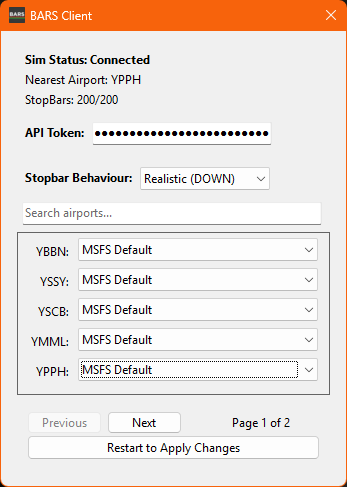

# Pilot Guide

In the real world, aerodrome controllers use stopbars as a bar of illuminated lights preventing aircraft from entering active runways. Within Microsoft Flight Simulator, this can be emulated using the BARS Ground client. Stopbar state is shared between pilots and controllers participating in the plugin.

 

> [!WARNING]  
>  Due to simulator limitations in MSFS 2020, the stopbar lights may not render until closer to the holding point. However, this does not affect the stopbar's functionality and will operate as intended.

## Setup

### Installation  
The BARS Ground client <ins> for pilots </ins> can be installed through [Github releases](https://github.com/AussieScorcher/BARS/releases). If the client is installed correctly, you should be able to search for "BARS Client" in windows, once opened the client will be minimzed into the desktop taskbar tray.

 

<figure>
    
    <figcaption></figcaption>
</figure>

 

### Connection
Upon launching your preferred simulator, the BARS Ground client will automatically open. Once located at a [compatible airport](#compatible-airports--scenery), locate the BARS Client icon in the desktop taskbar tray, right-click, and select "Show." The client will display important information, including the current status, the closest airport, and the number of stopbars spawned. 

 

<figure>
    
    <figcaption></figcaption>
</figure>

 

### Third Party Scenery
To configure BARS Ground for third-party scenery, reopen the BARS Client from the desktop taskbar tray after the initial installation. Navigate to the "Scenery Section" title, find the compatible airport's ICAO code, and click the dropdown menu. Select your payware scenery and click the "Restart to Apply" button at the bottom. This will restart the BARS Ground client, and once completed, stopbars will be successfully configured for your favorite payware airports.

 

<figure>
    
    <figcaption></figcaption>
</figure>

 

## Compatible Airports & Scenery

| **Airport ICAO** | **Scenery**                  |
|--------------|--------------------------|
| YBBN         | Orbx Brisbane, iniBuilds Brisbane |
| YSSY         | FlyTampa Sydney          |
| YSCB         | Impulse Sim Canberra     |
| YMML         | Orbx Melbourne           |
| YPPH         | Axonox Perth             |

 

### Reporting BARS Ground Issues

> [!TIP]  
>  If you encounter any issues with BARS, you can report them via the GitHub repository's "Issues" tab or by messaging a maintainer directly through Discord. When submitting an issue, it’s essential to include as much detail as possible to help with troubleshooting. If required, you may need to provide the log file generated by BARS. These logs can be found in your `%localappdata%/BARS` file.